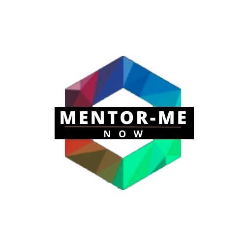

# README <a name="readme-top"></a>

<div align="center">
  
  <br/>
  <br/>
  <br/>
</div>

## Table of Contents

- [About Project](#about-project)
- [Built With](#built-with)
- [Tech Stack](#tech-stack)
- [Key Features](#key-features)
- [Getting Started](#getting-started)
  - [Prerequisites](#prerequisites)
  - [Setup](#setup)
  - [Install](#install)
- [Usage](#usage)
- [Kanban Board](#kanban-board)
- [Author](#author)
- [Future Features](#future-features)
- [Contributing](#contributing)
- [Show your support](#show-your-support)
- [Acknowledgements](#acknowledgements)
- [License](#license)

## About Project <a name="about-project"></a>

**MentorMeNow** is a web application designed to connect mentees with experienced mentors across various fields. Our app streamlines the process of finding and scheduling sessions with mentors, facilitating personal and professional growth.

## Built With <a name="built-with"></a>

- React
- Vite
- TailwindCSS

## Tech Stack <a name="tech-stack"></a>

- React
- Redux Toolkit
- Vite
- TailwindCSS

## Key Features <a name="key-features"></a>

### Mentor Discovery
- **Browse Mentors:** Users can explore a comprehensive list of mentors, gaining insights into their expertise.
- **Mentor Profiles:** Access detailed profiles of each mentor, including experience, and areas of specialization, skills, and hourly fees for mentoring sessions.

### User Accounts
- **Easy Signup/Login:** Secure signup and login process using usernames, allowing users to access personalized features and manage their mentoring activities.

### Mentorship Sessions
- **Appointment Scheduling:** Seamlessly book appointments with mentors of your choice, based on your preferences.

### Collaborative Features
- **Add/Remove Mentors:** Users can contribute to the platform by adding new mentors to the list. Similarly, users can suggest the removal of mentors as needed, maintaining the quality and relevance of the mentor pool.


## Getting Started <a name="getting-started"></a>

### Prerequisites <a name="prerequisites"></a>

- Node.js v18 minimum
- npm or yarn
- Access to the **MentorMeNow Backend** app running locally. --- [See MentorMeNow Backend repository for more details](https://github.com/Ayokunnumi1/mentor_me_now_back_end)

### Setup <a name="setup"></a>

1. Clone this repository

```bash
git clone https://github.com/martinkarugaba/mentor_me_now_front_end.git
cd mentor_me_now_front_end
```

2. Install dependencies

```bash
npm install
# or
yarn install
```

### Install <a name="install"></a>

After cloning the repo and moving into the project directory, install the dependencies:

```bash
npm install
# or
yarn
```

### Usage <a name="usage"></a>

Start the development server:

```bash
npm run dev
# or
yarn dev
```

Open `http://localhost:5173/` to view it in your browser.

Ensure the **MentorMeNow Backend** app is running to fetch data successfully. For details on running the **MentorMeNow Backend** app, refer to its [README](https://github.com/Ayokunnumi1/mentor_me_now_back_end).


## Kanban Board <a name="kanban-board"></a>
- [Kanban board link](https://github.com/users/martinkarugaba/projects/11/views/1)
- [Kanban board initial state](./kabanboardinitialstate.png)
- We are a team of 3 members as indicated in the authors section

## Author <a name="author"></a>

- Martin Karugaba - [@martinkarugaba](https://github.com/martinkarugaba)
- Ayokunnumi Omololu - [@Ayokunnumi1](https://github.com/Ayokunnumi1)
- Nelly Telli - [@lily4178993](https://github.com/lily4178993/)

## Future Features <a name="future-features"></a>

- Implement proper user authentication from the front-end to the server.
- Implement features for Administrator user.
- Make sure that the "Add item" and "Delete item" links are accessible only by users who are admins
- Enhance UI/UX with animations.

## Contributing <a name="contributing"></a>

Contributions, issues, and feature requests are welcome!

Feel free to check the [issues page](https://github.com/martinkarugaba/mentor_me_now_front_end/issues).

## Show your support <a name="support"></a>

Give a ⭐️ if this project helped you!

## Acknowledgements <a name="acknowledgements"></a>

- [MentorMeNow Backend](https://github.com/Ayokunnumi1/mentor_me_now_back_end) for providing the API
- [Murat Korkmaz](https://www.behance.net/muratk) for the [original design on Behance](https://www.behance.net/gallery/26425031/Vespa-Responsive-Redesign) 
- [Microverse](https://github.com/microverseinc)
- React Documentation
- TailwindCSS Documentation
- Vite Documentation

## License <a name="license"></a>

This project is [MIT licensed](./LICENSE).

<p align="right">(<a href="#readme-top">back to top</a>)</p>